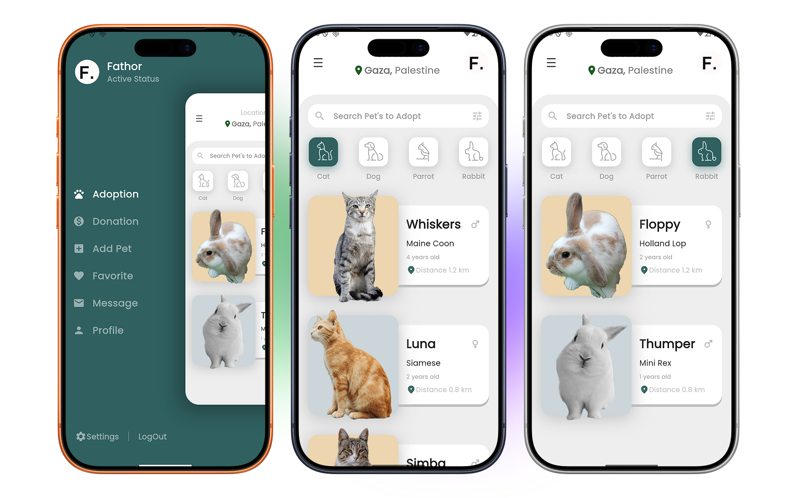

# Slide Drawer - Pet Adoption App

<div align="center">



**A beautiful and responsive Flutter application for browsing and discovering pets available for adoption.**

[](https://flutter.dev)
[](https://dart.dev)
[](LICENSE)
[](pubspec.yaml)

</div>

---

## 📋 Table of Contents

- [Project Overview](#project-overview)
- [Features](#features)
- [Tech Stack](#tech-stack)
- [Installation](#installation)
- [Usage](#usage)
- [Project Structure](#project-structure)
- [Contributing](#contributing)
- [Testing](#testing)
- [Roadmap](#roadmap)
- [License](#license)
- [Contact](#contact)

---

## 🎯 Project Overview

**Slide Drawer** is a modern Flutter application that makes pet adoption easy and enjoyable. Users can browse through various types of pets (cats, dogs, parrots, and rabbits), view detailed information about each pet, and discover new companions available for adoption in their area.

The app features a smooth, animated user interface with responsive design that works seamlessly across mobile devices, tablets, and desktop platforms. It demonstrates advanced Flutter concepts including state management with Provider, responsive design patterns, custom animations, and cross-platform compatibility.

---

## ✨ Features

- 🐾 **Multi-Pet Categories** - Browse cats, dogs, parrots, and rabbits with dedicated sections for each
- 🔍 **Search & Filter** - Search for pets and filter results based on preferences
- 🎨 **Beautiful UI** - Modern, clean interface with smooth animations and transitions
- 📱 **Fully Responsive** - Optimized for mobile phones, tablets, and desktop displays
- 🔄 **Dynamic State Management** - Provider-based state management for efficient data handling
- 🌈 **Custom Theming** - Consistent color scheme and typography across the app
- 📍 **Location Information** - View pets by distance and owner information
- 🖥️ **Cross-Platform Support** - Native support for iOS, Android, macOS, Windows, Linux, and Web
- ⚡ **High Performance** - Optimized refresh rates and smooth 60/120 FPS rendering on Android
- 🎭 **Drawer Animation** - Smooth slide drawer animations for navigation

---

## 🛠 Tech Stack

### Languages & Frameworks
- **Language**: Dart 3.10.7+
- **Framework**: Flutter 3.10.7+
- **State Management**: Provider 6.1.5

### Dependencies
| Package | Version | Purpose |
|---------|---------|---------|
| `provider` | 6.1.5 | State management and reactive updates |
| `go_router` | 17.0.1 | Navigation and routing |
| `google_fonts` | 7.0.0 | Custom Google Fonts typography |
| `get_it` | 9.2.0 | Service locator and dependency injection |
| `internet_connection_checker` | 3.0.1 | Network connectivity monitoring |
| `flutter_native_splash` | 2.4.7 | Native splash screen implementation |
| `flutter_displaymode` | 0.7.0 | High refresh rate support (Android) |
| `desktop_window` | 0.4.2 | Desktop window management |
| `sized_context` | 1.0.0+4 | Responsive sizing utilities |
| `cupertino_icons` | 1.0.8 | iOS-style icons |

### Development Tools
- **Build Runner** 2.10.4 - Code generation
- **Flutter Lints** 6.0.0 - Code quality and best practices

---

## 📦 Installation

### Prerequisites

Before you begin, ensure you have the following installed:

- **Flutter SDK** 3.10.7 or higher ([Install Flutter](https://flutter.dev/docs/get-started/install))
- **Dart** 3.10.7 or higher (included with Flutter)
- **Git** (for cloning the repository)
- **Xcode** (for iOS development on macOS)
- **Android Studio** (for Android development)

### Step-by-Step Setup

1. **Clone the Repository**
   ```bash
   git clone https://github.com/fathorrosi-dev/slide_drawer.git
   cd slide_drawer
   ```

2. **Install Dependencies**
   ```bash
   flutter pub get
   ```

3. **Generate Build Files** (if needed)
   ```bash
   flutter pub run build_runner build
   ```

4. **Set Up Devices**
   - List available devices:
     ```bash
     flutter devices
     ```
   - Ensure at least one device is available (emulator, simulator, or physical device)

5. **Run the Application**
   ```bash
   # Run on default device
   flutter run

   # Run with specific device
   flutter run -d <device_id>

   # Run in release mode (optimized)
   flutter run --release
   ```

### Environment-Specific Setup

**iOS Development:**
```bash
cd ios
pod install
cd ..
flutter run
```

**Android Development:**
- Ensure Android SDK is installed
- Accept all licenses: `flutter doctor --android-licenses`

**Web Development:**
```bash
flutter run -d chrome
# or
flutter run -d firefox
```

**Desktop Development (macOS/Windows/Linux):**
```bash
flutter run -d macos   # macOS
flutter run -d windows # Windows
flutter run -d linux   # Linux
```

---

## 🚀 Usage

### Basic Launch

Simply run the app on your preferred device:
```bash
flutter run
```

### Key Features Usage

#### Browsing Pets
1. The home screen displays a list of available pets
2. Tap the pet category buttons (Cats, Dogs, Parrots, Rabbits) to filter results
3. Scroll through the list to explore different pets

#### Searching Pets
- Use the search bar at the top of the pet list
- Type a pet's name or breed to filter results
- Use the filter icon (⚙️) to access advanced search options

#### Viewing Pet Details
- Tap on a pet card to view detailed information
- See pet owner's profile, distance from your location, and other details
- Check availability status and contact information

### Configuration

**Custom Color Scheme:**
Edit [lib/view/styles/colors.dart](lib/view/styles/colors.dart) to customize the app's color palette.

**Typography:**
Modify [lib/view/styles/styles.dart](lib/view/styles/styles.dart) to change fonts and text styles.

**Responsive Breakpoints:**
Adjust screen size logic in [lib/logic/app_logic.dart](lib/logic/app_logic.dart) for custom breakpoints.

**Asset Management:**
Add new images or assets in the `assets/` directory and update [pubspec.yaml](pubspec.yaml).

---

## 📂 Project Structure

```
slide_drawer/
├── lib/
│   ├── main.dart                          # App entry point
│   ├── injection.dart                     # Dependency injection setup
│   ├── logic/
│   │   ├── app_logic.dart                 # Core application logic
│   │   └── common/
│   │       ├── color_utils.dart           # Color utility functions
│   │       └── platform_info.dart         # Platform detection
│   ├── provider/
│   │   └── main_background_provider.dart  # Global state management
│   ├── view/
│   │   ├── app_scaffold.dart              # Main app scaffold
│   │   ├── router.dart                    # Navigation routing
│   │   ├── styles/
│   │   │   ├── colors.dart                # Color definitions
│   │   │   ├── color_extensions.dart      # Color extensions
│   │   │   └── styles.dart                # Global style definitions
│   │   ├── utils/
│   │   │   └── app_scroll_behavior.dart   # Custom scroll behavior
│   │   └── home_screen/
│   │       ├── home_screen.dart           # Main home screen
│   │       └── components/
│   │           ├── pet_model.dart         # Pet data models
│   │           ├── pet_button.dart        # Pet category button
│   │           ├── pet_button_model.dart  # Pet button model
│   │           ├── pet_card.dart          # Pet card widget
│   │           ├── top_profile.dart       # User profile section
│   │           ├── top_section.dart       # Header section
│   │           ├── bottom_section.dart    # Footer section
│   │           ├── custom_list.dart       # Custom list widget
│   │           ├── drawer_buttons.dart    # Drawer navigation buttons
│   │           ├── main_background_drawer.dart # Drawer component
│   │           ├── menu_button.dart       # Menu button widget
│   │           ├── line.dart              # Decorative line
│   │           ├── profile_image.dart     # Profile image widget
│   │           └── resized_screen.dart    # Responsive wrapper
│   └── view/
├── assets/
│   ├── images/
│   │   ├── cat/                           # Cat images
│   │   ├── dog/                           # Dog images
│   │   ├── rabbit/                        # Rabbit images
│   │   └── bird/                          # Parrot images
│   └── icons/                             # App icons
├── test/
│   └── widget_test.dart                   # Widget tests
├── android/                               # Android native code
├── ios/                                   # iOS native code
├── macos/                                 # macOS native code
├── windows/                               # Windows native code
├── linux/                                 # Linux native code
├── web/                                   # Web platform files
├── pubspec.yaml                           # Project dependencies
├── pubspec.lock                           # Locked dependency versions
├── analysis_options.yaml                  # Linter configuration
└── README.md                              # This file
```

---

## 🤝 Contributing

We welcome contributions from the community! Here's how you can help:

### Getting Started
1. **Fork** the repository on GitHub
2. **Clone** your fork locally
   ```bash
   git clone https://github.com/your-username/slide_drawer.git
   cd slide_drawer
   ```
3. **Create** a new branch for your feature
   ```bash
   git checkout -b feature/amazing-feature
   ```

### Development Workflow

1. **Install dependencies**
   ```bash
   flutter pub get
   ```

2. **Make your changes** following the code style guidelines below

3. **Commit your changes**
   ```bash
   git commit -m "feat: Add amazing feature"
   ```

4. **Push to your fork**
   ```bash
   git push origin feature/amazing-feature
   ```

5. **Open a Pull Request** with a clear description of your changes

### Code Style Guidelines

- **Dart Formatting**: Use `flutter format lib/ test/`
- **Linting**: Ensure all files pass `flutter analyze`
- **Naming Conventions**:
  - Classes: `PascalCase` (e.g., `PetModel`)
  - Functions/Variables: `camelCase` (e.g., `getPetList()`)
  - Constants: `camelCase` (e.g., `maxImageSize`)
- **Documentation**: Add comments for complex logic and public APIs
- **Imports**: Organize imports alphabetically and separate by category (dart, flutter, packages, local)

### Pull Request Process

1. Update [README.md](#) with any new features or changes
2. Add tests for new functionality (see Testing section)
3. Ensure `flutter analyze` passes without errors
4. Request review from maintainers
5. Address review feedback before merging

### Report Issues

If you find a bug or have a feature request:
1. Check existing [Issues](https://github.com/fathorrosi-dev/slide_drawer/issues)
2. Create a new issue with:
   - Clear description
   - Steps to reproduce (for bugs)
   - Expected vs. actual behavior
   - Flutter & Dart version information

---

## 🧪 Testing

### Running Tests

```bash
# Run all tests
flutter test

# Run tests with coverage
flutter test --coverage

# Run tests in verbose mode
flutter test --verbose

# Run specific test file
flutter test test/widget_test.dart
```

### Test Structure
Tests are located in the [test/](test/) directory:
- `widget_test.dart` - Widget and UI tests

### Writing Tests

Example widget test:
```dart
void main() {
  testWidgets('Pet card displays correctly', (WidgetTester tester) async {
    await tester.pumpWidget(const MyApp());
    expect(find.byType(PetCard), findsOneWidget);
  });
}
```

### Best Practices
- Write tests for new features
- Maintain >70% code coverage for critical paths
- Use descriptive test names
- Test both happy paths and error cases

---

## 🗺️ Roadmap

### Version 1.1.0 (Planned)
- [ ] User authentication & profiles
- [ ] Pet favoriting system
- [ ] Advanced filters (age, breed, gender)
- [ ] In-app messaging with pet owners
- [ ] Pet adoption history & notifications

### Version 1.2.0 (Planned)
- [ ] Offline mode with local caching
- [ ] Social features (sharing, reviews)
- [ ] Pet health records integration
- [ ] Calendar for adoption appointments
- [ ] Analytics & personalized recommendations

### Future Enhancements
- [ ] Multi-language support
- [ ] Video tours of pets
- [ ] AR pet preview feature
- [ ] Backend API integration
- [ ] Payment processing for adoption fees

---

## 📄 License

This project is licensed under the MIT License - see the [LICENSE](LICENSE) file for details.

**MIT License Summary:**
- ✅ Permitted: Commercial use, modification, distribution, private use
- ❌ Forbidden: Liability, warranty
- ⚠️ Required: License and copyright notice

---

## 👥 Contact & Authors

**Maintainer:** [fathorrosi-dev](https://github.com/fathorrosi-dev)

### Get Help
- 📧 Email: [contact email if available]
- 🐛 Report Issues: [GitHub Issues](https://github.com/fathorrosi-dev/slide_drawer/issues)
- 💬 Discussions: [GitHub Discussions](https://github.com/fathorrosi-dev/slide_drawer/discussions)

### Connect
- 🌐 GitHub: [@fathorrosi-dev](https://github.com/fathorrosi-dev)
- 📱 Twitter: [@fathorrosi-dev](https://twitter.com/fathorrosi-dev) (if applicable)

---

## 📚 Additional Resources

- [Flutter Documentation](https://flutter.dev/docs)
- [Dart Language Guide](https://dart.dev/guides)
- [Provider Package Documentation](https://pub.dev/packages/provider)
- [Go Router Documentation](https://pub.dev/packages/go_router)

---

<div align="center">

**Made with ❤️ by the slide_drawer team**

[Star this repo](https://github.com/fathorrosi-dev/slide_drawer) if you find it useful! ⭐

</div>
